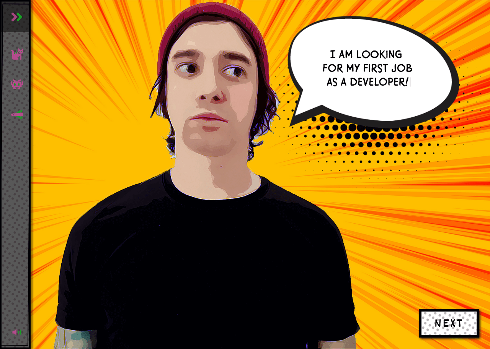
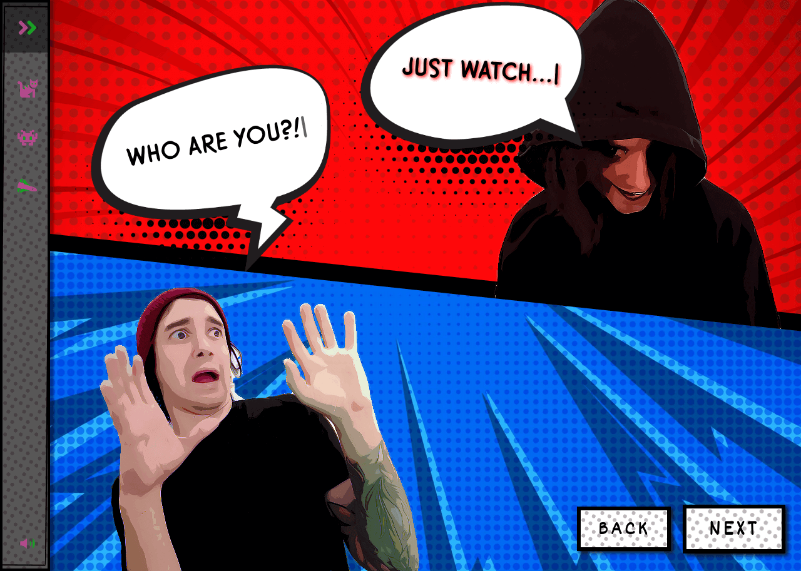
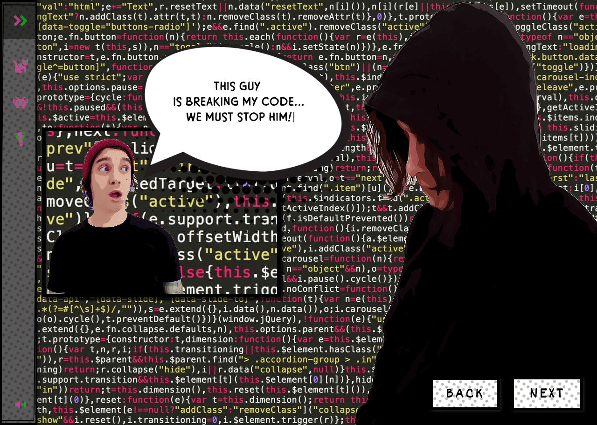

### This is my comic style portfolio build with React, GSAP & CSS 

You can run the app with npm install & npm start. Open http://localhost:3000 to view it in the browser.

This is a work in progress, I make commits every day!

Preview:

